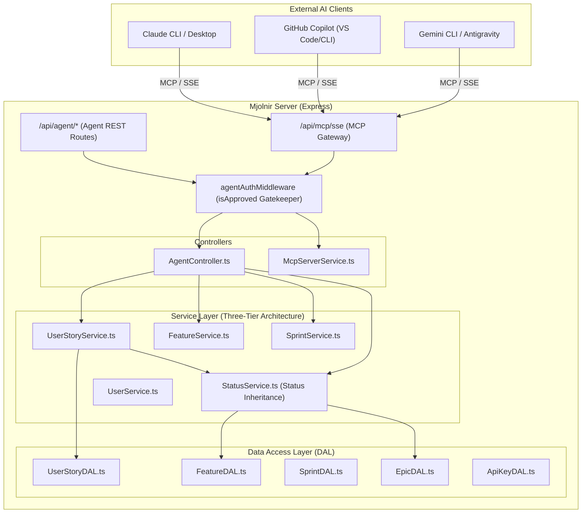

# Specification: Least-Privileged Agent Architecture & Direct MCP Integration

**Status**: Approved / Ready for Implementation  
**Security Model**: Principle of Least Privilege (PoLP) for AI Agents  
**Protocol Support**: Direct Server-Hosted MCP (`/api/mcp/sse`) & Dedicated Agent API (`/api/agent/*`)  
**Target Clients**: Google Gemini CLI / Antigravity, GitHub Copilot (VS Code & CLI), Claude CLI / Claude Desktop  

---

## 1. Core Philosophy: Least Privilege for AI Agents

To guarantee system integrity and prevent AI assistants from making unintended destructive changes or unauthorized structural edits, the agent interface enforces **strict least privilege boundaries**:

### What the Agent CAN do:
1. **Read-Only Access**:
   - List and view user stories (defaults to current user's stories in the active sprint).
   - View Epics, Features, Sprints, and approved Team Members.
   - View authenticated user profile (`whoami`).
2. **Create New User Stories (Tasks)**:
   - Create a task with `title`, `storyPoints` (mandatory), `featureId` (mandatory), `description`, and optional sprint/assignee.
3. **Update Task Status ONLY**:
   - Advance or transition a task status (`'To Do'`, `'In Progress'`, `'Blocked'`, `'Waiting for MR'`, `'Done'`).
   - Automatically triggers Mjolnir's **Status Inheritance Protocol** via `StatusService`.

### What the Agent CANNOT do (Strictly Forbidden & Blocked at API Level):
- ❌ **Cannot delete** user stories, epics, features, or sprints.
- ❌ **Cannot modify** story titles, descriptions, story points, or reassign users after creation.
- ❌ **Cannot create, edit, or delete** Epics or Features.
- ❌ **Cannot create, edit, or delete** Sprints.
- ❌ **Cannot modify** user accounts or approval permissions.

---

## 2. Dedicated Agent Route Tier (`/api/agent/*`)

Rather than exposing general-purpose administrative endpoints to agents, the backend provides dedicated agent-scoped routes in `server/src/routes/agentRoutes.ts` with `AgentController.ts`.

Both `/api/agent/*` and `/api/mcp/*` call the same underlying business logic services (`UserStoryService`, `FeatureService`, `SprintService`, `StatusService`, `UserService`).



---

## 3. Dedicated Agent REST Endpoints Specification

All endpoints require `x-api-key: mj_live_...` or `Authorization: Bearer mj_live_...` and verify `isApproved === true`.

### 3.1 Task Operations (User Stories)

| Method | Endpoint | Description | Scope |
| :--- | :--- | :--- | :--- |
| `GET` | `/api/agent/us` | List stories. **Default: stories assigned to current user in active sprint**. | `read:tasks` |
| `GET` | `/api/agent/us/:id` | Get details of a single user story. | `read:tasks` |
| `POST` | `/api/agent/us` | Create a new user story. Mandatory: `title`, `storyPoints`, `featureId`. | `write:tasks` |
| `PATCH` | `/api/agent/us/:id/status` | Update **only** story status (`'To Do'`, `'In Progress'`, etc.). | `write:tasks` |

> [!IMPORTANT]
> Any `PUT /api/agent/us/:id` or requests attempting to modify `title`, `storyPoints`, or delete tasks return `405 Method Not Allowed` or `403 Forbidden`.

#### Query Parameters for `GET /api/agent/us`:
- `assignedUser` *(string, default: `'me'`)*: Filter by `'me'`, specific user ID, or user email/name. Set to `'all'` for entire team.
- `sprint` *(string, default: `'active'`)*: Filter by `'active'`, sprint ID, or sprint name. Set to `'all'` or `'backlog'` for backlog.
- `featureId` *(string, optional)*: Filter by parent feature ID.
- `status` *(string, optional)*: Filter by status.
- `limit` *(number, default: `50`, max: `200`)*.

#### Request Body for `POST /api/agent/us`:
```json
{
  "title": "Add input sanitization for agent routes",
  "description": "Ensure least privilege boundaries are validated in AgentController",
  "storyPoints": 3,
  "featureId": "664b3c1a1234567890abcdef",
  "sprintId": "664b3c0e1234567890abcdef",
  "assignedUserId": "664b3c991234567890abcdef"
}
```

#### Request Body for `PATCH /api/agent/us/:id/status`:
```json
{
  "status": "In Progress"
}
```
*Triggers Status Inheritance protocol: parent Feature & grandparent Epic automatically transition to `'In Progress'`.*

---

### 3.2 Read-Only Discovery Endpoints

| Method | Endpoint | Description |
| :--- | :--- | :--- |
| `GET` | `/api/agent/epic` | List all epics (read-only). |
| `GET` | `/api/agent/feature` | List features, optionally filtered by `epicId` (read-only). |
| `GET` | `/api/agent/sprints` | List all sprints and active sprint dates (read-only). |
| `GET` | `/api/agent/users` | List approved team members for assignment (read-only). |
| `GET` | `/api/agent/me` | Get profile of authenticated user (`whoami`). |

---

## 4. MCP Tools Specification (Least-Privileged Set)

The remote MCP server exposed at `/api/mcp/sse` registers **only** the least-privileged toolset:

| Tool Name | Operation Type | Description |
| :--- | :--- | :--- |
| `mjolnir_list_user_stories` | **Read** | Lists stories. Default: assigned to current user in active sprint. |
| `mjolnir_get_user_story` | **Read** | Get details of a single story by ID. |
| `mjolnir_create_user_story` | **Create** | Creates a new user story (mandatory: `title`, `story_points`, `feature_id`). |
| `mjolnir_update_user_story_status` | **Update Status Only** | Updates status of a story (`'To Do'`, `'In Progress'`, `'Blocked'`, `'Waiting for MR'`, `'Done'`). Triggers status inheritance. |
| `mjolnir_list_features` | **Read** | Lists features to locate valid `featureId`. |
| `mjolnir_list_epics` | **Read** | Lists epics. |
| `mjolnir_get_active_sprint` | **Read** | Gets the currently active sprint. |
| `mjolnir_list_team_members` | **Read** | Lists approved users for story assignment. |
| `mjolnir_get_current_user` | **Read** | Gets authenticated user profile. |

---

## 5. API Key Management & UI Modal

### 5.1 API Key Data Model
```typescript
// server/src/models/ApiKey.ts
export type ApiKey = Document & {
  key: string;            // Formatted as 'mj_live_<random_hex>'
  userId: mongoose.Types.ObjectId;
  name: string;           // e.g. "Agent Integration Key"
  lastUsedAt?: Date;
  expiresAt?: Date;
  createdAt: Date;
};
```

### 5.2 UI Modal (`client/src/components/ApiKeyModal/ApiKeyModalContent.tsx`)
- Trigger button in navigation header (`DashboardLayout.tsx`): **"🔑 API Key"**.
- Displays personal key with one-click copy button and regenerate option.
- Ready-to-copy configuration blocks for **Gemini / Antigravity**, **VS Code Copilot**, and **Claude**.

---

## 6. Repository Context Configuration (`.mjolnir.json`)

Developers can add an optional `.mjolnir.json` file in any repository to automatically bind stories created in that repository to a specific Feature:

```json
{
  "$schema": "https://mjolnir.app/schemas/repo-config.json",
  "epicId": "664b3c0e1234567890abcdef",
  "featureId": "664b3c1a1234567890abcdef",
  "defaultStoryPoints": 2
}
```

If `.mjolnir.json` is not present, the agent automatically calls `mjolnir_list_features` and prompts the user or picks the relevant feature.

---

## 7. AI Assistant Connection Setup (Zero-Publish / Direct URL)

### 7.1 Google Gemini CLI / Antigravity
Add to your Antigravity / Gemini MCP settings (`settings.json`):

```json
{
  "mcpServers": {
    "mjolnir": {
      "url": "http://localhost:5000/api/mcp/sse",
      "headers": {
        "x-api-key": "mj_live_YOUR_PERSONAL_API_KEY"
      }
    }
  }
}
```

### 7.2 GitHub Copilot (VS Code)
Add to `.vscode/settings.json`:

```json
{
  "github.copilot.chat.mcpServers": {
    "mjolnir": {
      "url": "http://localhost:5000/api/mcp/sse",
      "headers": {
        "x-api-key": "mj_live_YOUR_PERSONAL_API_KEY"
      }
    }
  }
}
```

### 7.3 Claude CLI / Claude Desktop
Add to `claude_desktop_config.json`:

```json
{
  "mcpServers": {
    "mjolnir": {
      "url": "http://localhost:5000/api/mcp/sse",
      "headers": {
        "x-api-key": "mj_live_YOUR_PERSONAL_API_KEY"
      }
    }
  }
}
```

---

## 8. Implementation Checklist & Layer Boundaries

Following `server/AGENTS.md` and `client/AGENTS.md`:

### Backend (Server)
- [ ] **DAL**:
  - `ApiKeyDAL.ts`: CRUD for `ApiKey` model.
- [ ] **Service**:
  - `ApiKeyService.ts`: Key generation, verification, user linking.
  - `McpServerService.ts`: Registers least-privileged toolset and maps to backend services.
- [ ] **Middleware**:
  - `agentAuth.ts`: API key authentication, `isApproved === true` validation.
- [ ] **Controller**:
  - `AgentController.ts`: Least-privileged route handlers (`listUserStories`, `createUserStory`, `updateUserStoryStatus`, `listEpics`, `listFeatures`, `listSprints`, `listUsers`, `getCurrentUser`).
- [ ] **Routes**:
  - `agentRoutes.ts`: Mounted at `/api/agent`.
  - `mcpRoutes.ts`: Mounted at `/api/mcp`.
  - `apiKeyRoutes.ts`: Mounted at `/api/auth/api-key`.

### Frontend (Client)
- [ ] Header button: "🔑 API Key" in `DashboardLayout.tsx`.
- [ ] Modal: `ApiKeyModal.tsx` for key management and setup instructions.

### Tests
- [ ] E2E tests for API key verification and `isApproved` enforcement.
- [ ] Tests verifying that agent CANNOT perform unauthorized updates (e.g. changing title, deleting story).
- [ ] Tests verifying that updating status to `'In Progress'` triggers `StatusService` inheritance.
- [ ] Tests verifying that `GET /api/agent/us` returns the current user's active sprint stories by default.
